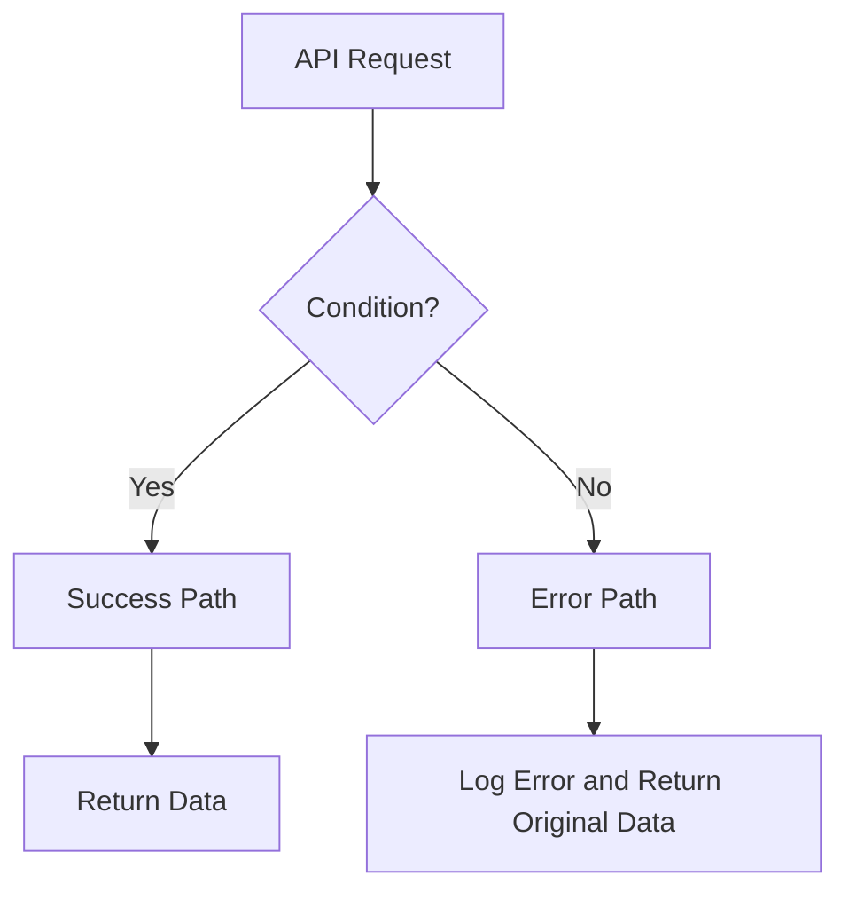

# Development Guidelines

## Git Commit Guidelines
- NEVER add any signature to commit messages (no "Generated with Codex" footer or similar)
- Do not add co-author information to commits
- NEVER create commits automatically - only provide commit messages for copy-paste
- Commit message format: 
  - Use conventional commit prefixes: feat, fix, chore, refactor, test, docs
  - Keep description concise and descriptive

## Code Quality Requirements
When implementing features, always ensure:
- ✅ Proper typing without generic types
- ✅ No type casting with `as <type>` - use String() conversions or proper type guards
- ✅ No magic numbers - use constants
- ✅ No magic strings - use constants
- ✅ Types and constants in `/common` directory
- ✅ Concise code
- ✅ Comprehensive unit tests
- ✅ No unnecessary comments or logging
- ✅ Follows existing patterns in the codebase
- ✅ Use `@/modules` imports when importing from other modules (not relative paths)
- ✅ Variables must have clear, descriptive names (e.g., `floorUnitPosition` not `fup`)
- ✅ Prefer early returns over if...else statements for better code readability

## Plan Mode Guidelines

When in plan mode, please be my thought partner. Don't be agreeable and push back when needed. Ask one question at a time in case of doubts.

## Best Practices and Learnings

1. **Use Database Enums**: Always prefer Prisma-generated enums (e.g., `enum_integration_type`) over custom constants for database-related values
2. **Avoid Unnecessary Abstractions**: Don't add mapping/transformation layers unless the API contract requires it
3. **Type Safety Over Runtime Checks**: Trust TypeScript types and API contracts rather than adding defensive runtime transformations
4. **Constants Location**: Place all constants in `/common/constants/` directory
5. **Interface Reuse**: Create specific interfaces for method parameters instead of inline types
6. **DTO Field Mapping**: When creating computed fields, ensure proper transformation pipeline from input to database operations

## Code Patterns

**Key principles:**
- Use descriptive variable names (`floorUnitPosition` instead of `fup`)
- Avoid unnecessary type casting when the DTO already defines the correct types
- Use underscore prefix for ignored variables (`_floors`) to satisfy linting rules
- Apply this pattern consistently on both sides of many-to-many relationships

### ⚠️ **CRITICAL: Avoid Object Destructuring with Spread Operator**

**DO NOT** use destructuring with spread operator on DTO objects as it loses class metadata and validation:

```typescript
// ❌ NEVER DO THIS - Loses DTO validations and class decorators
const { someField, ...restOfObject } = dtoInstance;
return restOfObject; // This is now a plain object, not a DTO instance

// ❌ ALSO AVOID - Creates plain objects that bypass validation
const transformed = { ...session };
delete transformed.someField;
```

**✅ PREFERRED APPROACHES:**
```typescript
// Option 1: Work with the DTO instance directly
dtoInstance.someField = newValue;
delete dtoInstance.unwantedField;
return dtoInstance; // Maintains class metadata and validation

// Option 2: Use plainToInstance to recreate DTO after transformation
const plainData = { ...dtoInstance };
delete plainData.unwantedField;
return plainToInstance(DtoClass, plainData);

// Option 3: Create new DTO instances explicitly
return new DtoClass({
  field1: dtoInstance.field1,
  field2: dtoInstance.field2,
  // explicitly list needed fields
});
```

**Why this matters:**
- DTO classes have validation decorators (`@IsString`, `@IsOptional`, etc.)
- Class-transformer decorators (`@Expose`, `@Transform`, `@Type`) require class metadata
- Spread operator creates plain objects that lose all class information
- This leads to validation bypasses and transformation failures

## Mermaid Chart Guidelines for GitHub PR Descriptions

When creating Mermaid flowcharts for GitHub PR descriptions, follow these formatting rules to avoid parsing errors:

### ✅ DO:
- Use simple text in node labels without special characters
- Replace arrows (`→`) with text like "to" or "becomes"
- Use "plus" instead of `+` symbol
- Use "minus" instead of `-` symbol
- Replace brackets `[]` with "array" or "list"
- Use line breaks (`<br/>`) for multi-line text in nodes
- Keep node IDs simple (single letters or short words)

### ❌ AVOID:
- Square brackets `[]` in text content
- Special symbols like `→`, `+`, `-` in node text
- Complex punctuation in node labels
- Unicode characters that might not parse correctly

### Example Format:


### Common Replacements:
- `[]` → "array" or "list" or "empty array"
- `→` → "to" or "becomes"
- `+` → "plus"
- `-` → "minus"
- `Returns: []` → "Returns empty array"
- `HTTP 503` → "HTTP 503" (OK to keep)
- `&` → "and"
