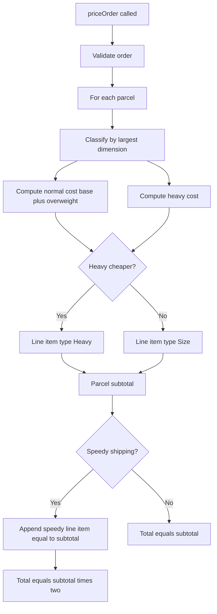
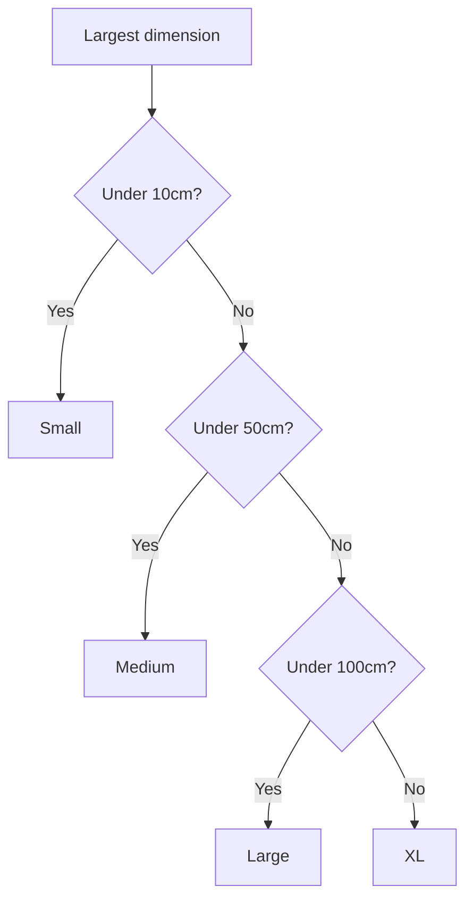

# First AML

A TypeScript library that prices parcel courier orders. Supports dimension-based and weight-based pricing tiers, per-parcel overweight surcharges, and an optional order-level speedy-shipping addon.

## Setup

```bash
npm install
```

## Scripts

| Command | Description |
|---|---|
| `npm install` | Install dependencies |
| `npm run typecheck` | Type-check without emitting files (`tsc --noEmit`) |
| `npm run lint` | Run ESLint on `src/` (strictTypeChecked ruleset; needs `tsconfig.json`) |
| `npm test` | Run all tests |
| `npm run test:coverage` | Run tests with coverage report (80% line threshold) |
| `npm run build` | Compile TypeScript to `dist/` |

## Architecture

Source layout:

| File | Holds |
|---|---|
| `src/index.ts` | Public surface (re-exports). |
| `src/pricing.ts` | `priceOrder()` plus parcel classification, validators, and pricing helpers. |
| `src/types.ts` | Public types and three string-literal registries used as line-item labels: `PARCEL_SIZE`, `PARCEL_RATE_TYPE`, `ORDER_ADDON`. |
| `src/errors.ts` | `ValidationError`. |

The three registries are deliberately separate. `PARCEL_SIZE` covers dimension-based classification (SMALL, MEDIUM, LARGE, XL). `PARCEL_RATE_TYPE` covers alternative pricing schemes selected by price comparison (currently just HEAVY). `ORDER_ADDON` covers order-level line items (currently just SPEEDY_SHIPPING). Keeping them split lets `classifyParcel()` honestly return only the labels dimensions can produce, and lets `PARCEL_PRICES` key only on the labels that have a fixed price.

Single public entry point:

```ts
priceOrder(order: Order): OrderPricingResult
```

## Pricing flow

For each call to `priceOrder(order)`:

1. **Validate** the order — at least one parcel, each parcel has at least one finite positive dimension and a finite positive weight.
2. **Per parcel**:
   - Classify by largest dimension.
   - Compute the dimension-based cost: `PARCEL_PRICES[size] + overweightCharge(weight, size)`.
   - Compute the Heavy cost: `$50 + ceil(max(0, weight - 50)) * $1`.
   - Pick the cheaper of the two. Ties favour the dimension-based label.
3. **Speedy shipping** (if `order.speedyShipping === true`): append an order-level line item whose cost equals the parcel subtotal.
4. **Total** = sum of all line items.



Dimension-based classification:



## Validation

Runtime validation runs at the library boundary inside `priceOrder()`. Any failure throws `ValidationError` with a message identifying the offending parcel index and field.

Invariants checked:

- The order contains at least one parcel.
- Each parcel has at least one dimension.
- Every dimension is a finite number greater than zero.
- Each parcel's weight is a finite number greater than zero.

Validation is handwritten rather than schema-driven. The input surface is small enough that a few targeted checks fully cover it, and the resulting error messages can stay specific to the failing field without library overhead.

## Testing

- `jest` with `ts-jest` for TypeScript support.
- Two suites:
  - `src/__tests__/index.test.ts` — public export surface.
  - `src/__tests__/pricing.test.ts` — pricing behaviour.
- Tests are organised by feature using nested `describe` blocks with `green paths`, `boundary cases`, and `red paths` sub-blocks.
- Coverage threshold is 80% line coverage; current coverage is 100% across `errors.ts`, `index.ts`, `pricing.ts`, and `types.ts`.

## Assumptions

## Step 1 Assumptions

- The library accepts an order containing one or more parcels.
- Each parcel contains a list of dimensions represented as positive numbers.
- Dimensions are provided in centimetres.
- The implementation should not assume fixed dimension names such as length, width, or height.
- At least one dimension is required per parcel.
- Parcel size is determined by evaluating all provided dimensions.
- Parcel categories are mutually exclusive and evaluated from smallest to largest.
- Boundary values move into the next category:
  - dimensions < 10cm => Small
  - dimensions < 50cm => Medium
  - dimensions < 100cm => Large
  - any dimension >= 100cm => XL
- The response includes:
  - one line item per parcel
  - parcel type
  - parcel cost
  - total order cost
- Runtime validation is performed at the library boundary:
  - dimensions must be finite numbers
  - dimensions must be greater than zero
- Invalid input should throw a clear validation error.

## Step 2 Assumptions

- Speedy shipping is an optional order-level pricing option.
- Speedy shipping is enabled through `speedyShipping?: boolean` on the order input.
- Speedy shipping is represented by an order-level line item type, not a parcel size.
- Speedy shipping does not participate in parcel classification logic.
- Parcel pricing is calculated first.
- Speedy shipping cost is calculated from the parcel subtotal.
- Speedy shipping cost is equal to the parcel subtotal, which means the final order total is doubled.
- Speedy shipping appears as a separate line item in the output.
- Speedy shipping does not modify individual parcel line item costs.
- If `speedyShipping` is omitted or `false`, no speedy shipping line item is added.
- The final order total is calculated from all line items after the optional speedy shipping line item is added.

## Step 3 Assumptions

- Each parcel now requires a `weight` property.
- Weight is provided in kilograms.
- Weight must be a positive finite number.
- Adding required `weight` is considered an intentional input contract change introduced by Step 3.
- Parcel type is still determined by dimensions only.
- Weight limits are evaluated after parcel type classification.
- Weight limits are inclusive:
  - Small parcel: up to and including 1kg
  - Medium parcel: up to and including 3kg
  - Large parcel: up to and including 6kg
  - XL parcel: up to and including 10kg
- Overweight charges apply only to the weight above the parcel type limit.
- Partial kilograms over the limit are rounded up to the next whole kilogram.
- Overweight charge is $2 per kg over the limit.
- Overweight charges are added directly to the parcel line item cost.
- Overweight charges are not represented as separate line items.
- Speedy shipping, if selected, is calculated after parcel line items include overweight charges.
- Existing parcel pricing and parcel classification behaviour should remain unchanged unless affected by overweight rules.
- Invalid weight input should throw a clear validation error.

## Step 4 Assumptions

- Heavy is a new parcel type.
- Heavy parcel pricing is determined by weight only.
- Heavy parcel costs:
  - $50 up to and including 50kg
  - plus $1 per kg over 50kg
- Partial kilograms over 50kg are rounded up to the next whole kilogram.
- Existing parcel types and overweight rules from Step 3 remain unchanged.
- For each parcel, the library should select the cheapest valid pricing option.
- Heavy parcel pricing should be compared against the existing dimension-based parcel pricing after overweight charges are applied.
- A parcel can qualify for Heavy pricing regardless of its dimensions.
- If Heavy pricing is selected, the parcel line item type should be `Heavy`.
- Parcel line item cost should represent the final selected parcel pricing option.
- Heavy pricing should not appear as a separate adjustment line item.
- Speedy shipping, if selected, is calculated after the final parcel pricing option is selected.
- Existing validation rules for dimensions and weight still apply.
- Invalid input should continue to throw clear validation errors.

## Tradeoffs / Design Decisions

- **Three string-literal registries instead of one.** `PARCEL_SIZE` (dimension classification), `PARCEL_RATE_TYPE` (alternative pricing schemes, currently just HEAVY), and `ORDER_ADDON` (order-level line items, currently just SPEEDY_SHIPPING) model genuinely different concepts. Folding them into one would force `classifyParcel()` to claim it can return HEAVY (it cannot) and `PARCEL_PRICES` to claim it holds a fixed Heavy price (it does not).
- **Heavy selection uses strict less-than.** When the Heavy cost equals the dimension-based cost, the dimension-based label wins. The brief is silent on ties; keeping the natural label unless Heavy is *strictly* cheaper is the less surprising default.
- **Overweight surcharge folds into the parcel line item's `cost`** rather than appearing as a separate line item. Matches the Step 3 brief and keeps the output shape unchanged from Step 1.
- **`speedyShipping` is a bare optional boolean on `Order`** rather than a nested `addons: { speedyShipping: true }` object. With one addon, the wrapper would be premature abstraction; refactoring later is mechanical.
- **`validateDimension` and `validateWeight` repeat the "finite positive number" predicate** instead of sharing a helper. The two failure messages must remain distinct (`"...must be a finite number"` vs `"...must be greater than zero"`) and existing tests assert on the exact text. Two small near-duplicate validators is the lesser evil.

## Future Improvements

- Replace the numeric `cost` with a typed `Money` value carrying currency, so the library is not silently USD-coupled.
- Surface a cost breakdown (base / overweight / heavy / speedy) on each line item for consumers that need transparency without inspecting `type`.
- Move pricing tables (sizes, weight limits, rates) into configuration to support per-region tariffs.
- Adopt a schema-based validator (e.g. zod) if the input contract grows beyond the current handful of fields.
